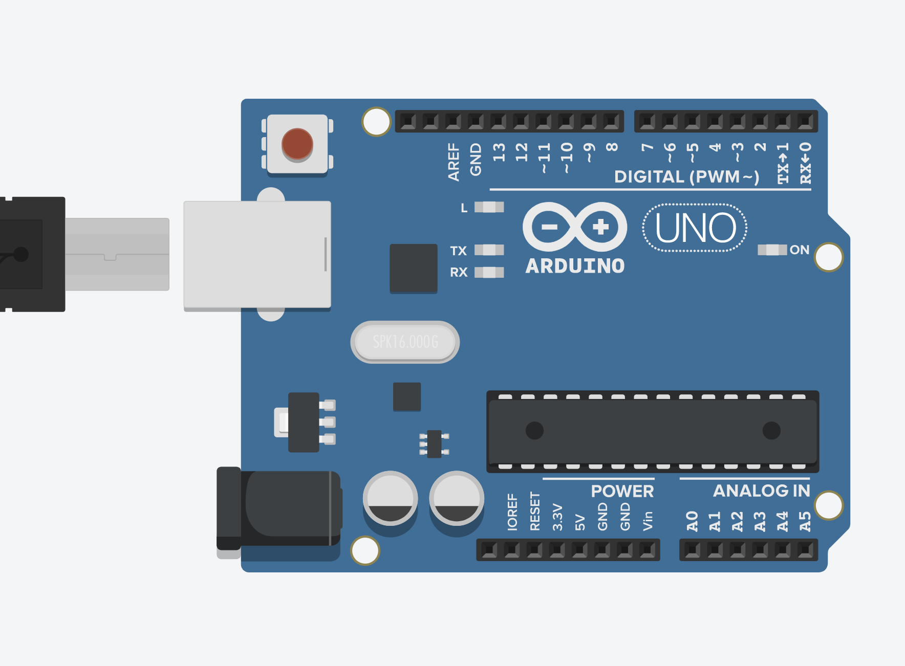
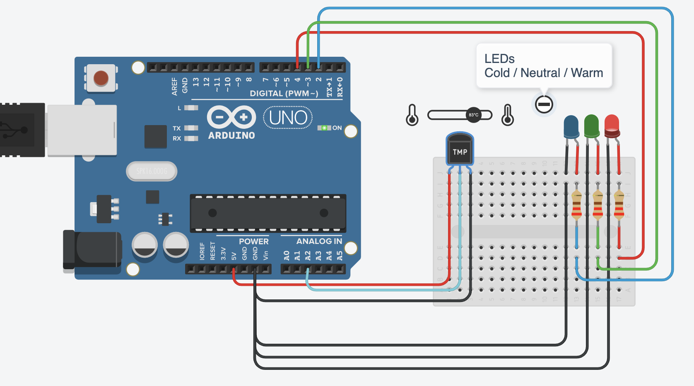
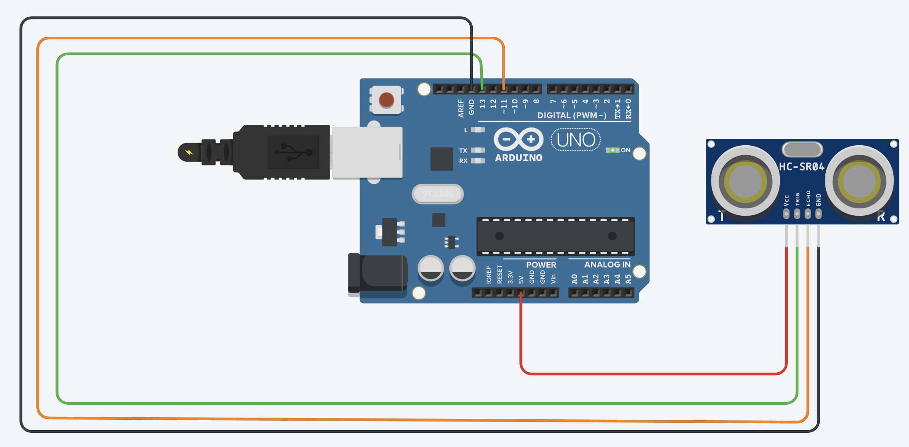
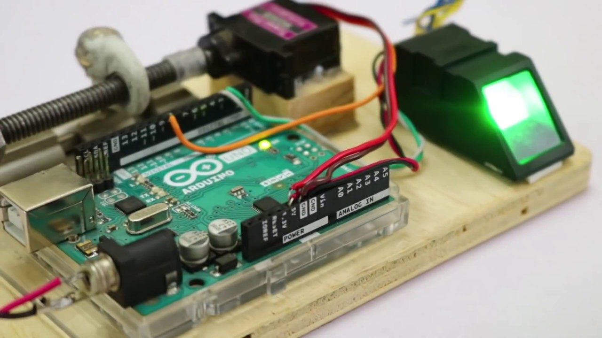
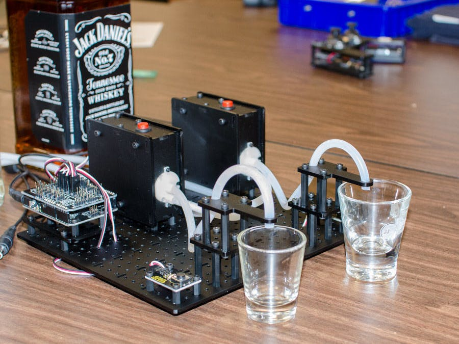

# NTUOSS Arduino Workshop
> By [Jay Gupta](https://github.com/guptajay) for [NTU Open Source Society](https://github.com/ntuoss)
  


  

This workshop is based on Arduino Uno and assumes elementary knowledge of C++ Programming.

> **Disclaimer** - This document is only meant to serve as a reference for the attendees of the workshop.
> It does not cover all the concepts or implementation details discussed during the actual workshop.

### Workshop Details
**When:** Friday, 14 Feb 2020. 6:30 PM - 8:30 PM   
**Where:** LHN-TR+17, The Arc - Learning Hub North (LHN), Nanyang Technological University   
**Who:** NTU Open Source Society   

### Errors
If you find any mistake (typo or anything else), please make a pull request or post an issue! Thanks!


***


### Foundations

A microcontroller is a computer system on a chip that does a job. It contains an integrated processor, memory (a small amount of RAM, program memory, or both), and programmable input/output peripherals, which are used to interact with things connected to the chip. A microcontroller is different than a microprocessor, which only contains a CPU.

Arduino is an open-source electronics platform based on easy-to-use hardware and software. 

Arduino boards are able to read inputs - light on a sensor, a finger on a button, or a Twitter message - and turn it into an output - activating a motor, turning on an LED, publishing something online. You can tell your board what to do by sending a set of instructions to the microcontroller on the board.


> **We are going to use Arduino Uno for this Workshop**

### Arduino Board Structure



* **Vin, 5V, 3.5V, GND** -  To provide power and ground the circuit.  
* **Reset** - Resets the microcontroller.  
* **Analog Pins (A0-A5)** - Receive Analog Input (0 - 5V).  
* **Digital Pins (0-13)** - Receive and Transmit Digital Data.  
* **Rx(0), Tx(1)** - Receive and Transmit Serial Data.  
* **Interrupt Pins (2, 3)** - Trigger an external Interrupt.  
* **PWM Pins (3, 5, 6, 9, 10, 11)** - Provide PWN Output. PWM is a technique to get analog results with digital means.  
* **SPI Pins (10, 11, 12, 13)** - Used for SPI Communication.  
* **InBuilt LED (13)** - Trigger the in-built LED.  

### Arduino Code Structure 
> Arduino code is written in C++ with an addition of special methods and functions.

```C
// Declare Global Variables 

// Set-Up the Arduino Board (Specify PINs to use as I/O) - PREPERATION BLOCK
void setup()
{
  // Code
}

// Main Program - EXECUTION BLOCK
void loop()
{
  // Code
}
```

### Task 1 - In-Built LED Blinker Circuit

```C
// Internal LED Blinker Circuit

int ledPin = 13;

void setup()
{
   // initialize pins as OUTPUT
   pinMode(ledPin, OUTPUT);
}

void loop()
{
  // Blink the LED
  digitalWrite(ledPin, HIGH);
  delay(1000);
  digitalWrite(ledPin, LOW);
  delay(1000);
}
```

### Task 2 - Intelligent ThermoStat



```C
// Intelligent ThermoStat

// Hot Temperature (in Celsius)
const int hot = 35; 

// Cold Temperature (in Celsius)
const int cold = 20;

void setup() {
  
  pinMode(A2, INPUT); // Temperature Sensor
  pinMode(2, OUTPUT); // Blue LED - Indicate Cold
  pinMode(3, OUTPUT); // Green LED - Indicate Neutral
  pinMode(4, OUTPUT); // Red LED - Indicate Hot
  Serial.begin(9600);
  
}

void loop() {
  
  int sensor = analogRead(A2);
  
  // Voltage Conversion
  float voltage = (sensor / 1024.0) * 5.0;
  float tempC = (voltage - .5) * 100;
  
  Serial.print("Temperature Detected: ");
  Serial.println(tempC);
  
  if (tempC < cold) {
    // It is Cold
    digitalWrite(2, HIGH); // Blue LED On
    digitalWrite(3, LOW); // Green LED Off
    digitalWrite(4, LOW); // Red LED Off
    Serial.println("It is Cold");
  }
  
  else if (tempC >= hot) {
    // It is Hot
    digitalWrite(2, LOW); // Blue LED Off
    digitalWrite(3, LOW); // Green LED Off
    digitalWrite(4, HIGH); // Red LED On
    Serial.println("It is Hot.");
  }
  else { 
    // It is Neutral
    digitalWrite(2, LOW); // Blue LED Off
    digitalWrite(3, HIGH); // Green LED On
    digitalWrite(4, LOW); // Red LED Off
    Serial.println("It is Fine.");
  }
  
  delay(1000);
  
}
```

### Task 3 - Measuring Speed of Sound using a UltraSonic Sensor



```C
// Measuring the Speed of Sound

// Ultrasonic Sensor PIN Configuration
int trigPin = 13;
int echoPin = 11;

// Measuring Ping Time
float pingTime;

float speedOfSound;

// Object Distance from Ultrasonic Sensor (in Inches)
float targetDistance = 6;

void setup()
{
  
  Serial.begin(9600);
  
  // Ultrasonic Sensor PIN Configuration
  pinMode(trigPin, OUTPUT);
  pinMode(echoPin, INPUT);
  
}

void loop()
{
  
  // Generate a Pulse
  digitalWrite(trigPin, LOW);
  delayMicroseconds(2000); 
  digitalWrite(trigPin, HIGH);
  delayMicroseconds(10); 
  digitalWrite(trigPin, LOW);
  
  // Measure Ping Time
  pingTime = pulseIn(echoPin, HIGH);
  
  // Calculating Speed of Sound
  speedOfSound = 2 * targetDistance / pingTime;
  speedOfSound = speedOfSound / 63360 * 1000000 * 3600;
  speedOfSound = speedOfSound * 0.44;
  
  Serial.print("The speed of sound is ");
  Serial.print(speedOfSound);
  Serial.println(" m/s");
  
  delay(3000);
  
}
```

***


### Moving Forward
**Congratualations on completing the very basics of Arduino!**

We have barely scratched the surface. The Arduino world is vast and there is a lot more that we can learn from tons of sensors such as Wi-Fi. Bluetooth, Cameras & GPS to advanced Motor & Servo control. 

##### Fingerprint Authenticator



##### Whiskey Dispensor



***


### References

> * https://simple.wikipedia.org/wiki/Microcontroller
> * https://www.arduino.cc/en/Guide/Introduction
